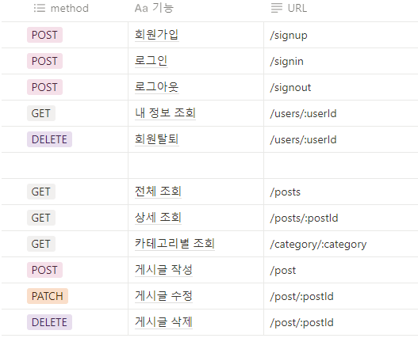
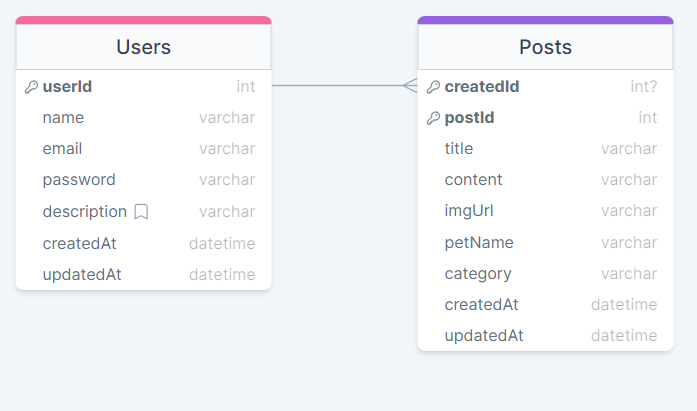

# 3-Layered Architecture Refactoring

## 목적

-  **3-Layered Architectur**
-  controller, service, repository로 세분화하여 유지보수 및 가독성을 향상시킨 프로젝트
-  errorhandling 발생하는 모든 에러는 통합된 에러 처리 **error-handler.middleware**를 통해 관리됩니다.
-  발생하는 에러를 효과적으로 처리하고 클라이언트에게 적절한 응답을 제공

## Skills

-  
-  
-  
-  
-  
-  

## API 명세서 URL



## ERD URL



## 폴더 구조

```
├── test.http
├── node_modules
├── prisma
│   └── schema.prisma
├── src
│   ├── controllers
│   │   ├── products.controller.js
│   │   └── users.controller.js
│   ├── middlewares
│   │   ├── error-handler.middleware.js
│   │   ├── input-vaildate.middleware.js
│   │   └── need-signin.middleware.js
│   ├── repositories
│   │   ├── products.repository.js
│   │   └── users.repository.js
│   ├── routers
│   │   ├── users.router.js
│   │   ├── products.router.js
│   │   └── users.router.js
│   ├── services
│   │   ├── users.service.js
│   │   └── products.service.js
│   ├── utils
│   │   └── prisma
│   │       └── index.js
│   └── app.js
├── .env
├── .gitignore
├── yarn.lock
├── package.json
└── README.md
```

## 환경변수

-  **PORT**: 서버 포트 번호
-  **DATABASE_URL**: Prisma 사용을 위한 DB URL
-  **PASSWORD_HASH_SALT_ROUNDS** : 비밀번호 Hash Salt 생성
-  **ACCESS_SECRET_KEY**: JWT AccessToken 암호키
-  **ACCESS_EXPIRATION_TIME**: JWT AccessToken 만료기간 설정
-  **REFRESH_SECRET_KEY**: JWT RefreshToken 암호키
-  **REFRESH_EXPIRATION_TIME**: JWT Refresh 만료기간 설정

## 실행 방법

```
yarn
yarn run dev
```
